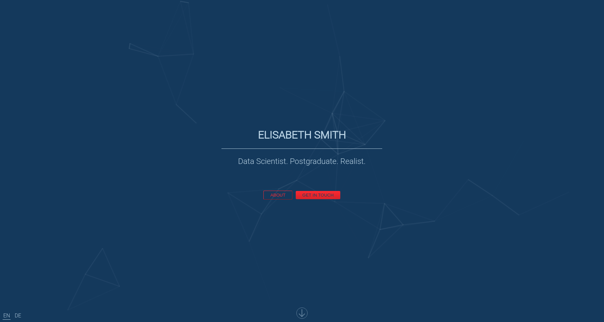
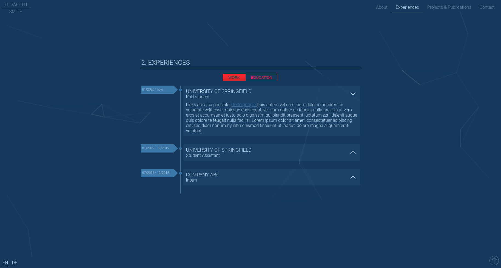
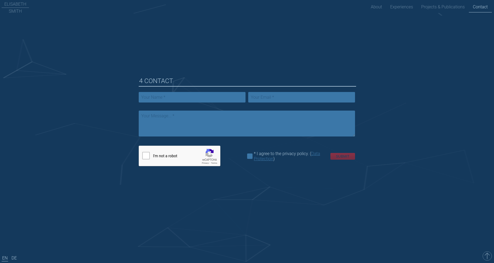

# Simple IT or Researcher Portfolio

This project includes a small react-based web application which can be used as a portfolio webpage. Feel free to use it, as long as you keep the attribution notice in the footer.
I used this project as a kind of a refresher in React without using a UI style library like Material UI or Bootstrap. Instead, it uses emotion for handling the css.

A demo of this template can be found [here](https://www.florian-franke.eu).

| Landing | Experiences | Contact Form |
|---------|-------------|--------------|
|  |  |  |


## Installing Instructions

### Prerequisites

#### Google Re-Captcha

For the contact form, you need to register your domain at Google Recaptcha:

1. Go to [the admin console of Google Recaptcha](https://www.google.com/recaptcha/admin/create)
2. Choose v2 and select the option "I am not a robot"
3. Add your domain

After you finished the process, copy the site key and secret key into two separate `.env` files:

- `frontend/.env`: `REACT_APP_GOOGLE_RECAPTCHA_SITEKEY={your sitekey goes here}`
- `server/.env`: `GOOGLE_RECAPTCHA_SECRET={your secret goes here}`

#### Email SMTP settings

In order that the server can send emails you need to update the `.env` file in the `server` directory:

```
SMTP_SERVER_ADDRESS={server address of your email provider}
SMTP_USERNAME={username of your email account}
SMTP_PASSWORD={password of your email account}
SMTP_PORT={port of the email smtp server}
FROM_ADDRESS={your email address which will be used for sending the email}
```

#### Final .env files

- `server/.env`:

```
GOOGLE_RECAPTCHA_SECRET={google recaptcha secret}

SMTP_SERVER_ADDRESS={server address of your email provider}
SMTP_USERNAME={username of your email account}
SMTP_PASSWORD={password of your email account}
SMTP_PORT={port of the email smtp server, e.g. 587}
FROM_ADDRESS={your email address which will be used for sending the email}

FRONTEND_URL={URL of your frontend application, might be https://{your domain}}
```

- `frontend/.env`:

```
REACT_APP_GOOGLE_RECAPTCHA_SITEKEY={google recaptcha sitekey}
REACT_APP_BACKEND_URL={URL of your backend}
```

#### Google Analytics (or other analysis provider)

You can integrate an analytics script into the `frontend/services/const/AppConstants.tsx` file. Make sure to also add the respective Cookie Text to the `frontend/services/const/LanguageData.tsx` file.

### Local Setup

In order to run the application locally, you need to go through the prerequisites steps described above, but for the domain, use `localhost` instead.

The `.env` files should look like:

- `server/.env`:

```
GOOGLE_RECAPTCHA_SECRET={google recaptcha secret}

SMTP_SERVER_ADDRESS={server address of your email provider}
SMTP_USERNAME={username of your email account}
SMTP_PASSWORD={password of your email account}
SMTP_PORT={port of the email smtp server, e.g. 587}
FROM_ADDRESS={your email address which will be used for sending the email}

FRONTEND_URL=http://localhost:3000
```

- `frontend/.env`:

```
REACT_APP_GOOGLE_RECAPTCHA_SITEKEY={google recaptcha sitekey}
REACT_APP_BACKEND_URL=http://localhost:3001
```

Then, you can start the services with:

- frontend:

```bash
cd frontend
yarn
yarn start
```

- backend:

```bash
cd server
yarn
yarn build
node build/index.js
```

### Deployment

In order to deploy the application, choose your setup and follow the steps.

#### nginx and systemd

1. Install nginx, nodejs (LTS), yarn, systemctl on your machine if needed.
2. Checkout and store the repository on your server, e.g. at `var/www/<your_website_name>`
3. Run inside the `frontend` and `backend` directory:

```bash
yarn
yarn build
```

4. Add a configuration file for nginx:

```bash
touch /etc/nginx/sites-available/<your_domain>
```

Insert the content of the file `deployment/nginx_sample_config`. Insert your domain there.

5. Activate it for nginx with:

```bash
cd /etc/nginx/sites-enabled/
ln -s /etc/nginx/sites-available/{your domain} {your domain}
```

6. Create the systemctl services by using the files provided in the `deployment` folder:

- `backend.service`
- `frontend.service`

Update the paths and domains inside these files. Move these files to `/etc/systemd/system/`.

7. Reload the services with

```bash
systemctl daemon-reload
sudo systemctl start backend
sudo systemctl start frontend
```

8. Restart nginx

```bash
sudo systemctl restart nginx
```

You can check the logs with

```
journalctl -u backend
journalctl -u frontend
```

## Customizations

### Update Personal Data

You can update the displayed information in following files:

* `frontend/src/services/const/LanguageData.tsx` - App content defined per language
* `frontend/src/services/const/AppConstants.tsx` - Personal data which does not change per language
* `frontend/public/index.html` - update the static app title. Will be overwritten by the app name defined in the constants file, but it is visible for a short amount of time before the full javascript was loaded.

### Language Data

You can update the application content and its translations in the file `frontend/src/services/const/LanguageData.tsx`

### Theme

You can update the base theme colors in the file `frontend/src/services/const/AppConstants.ts`

### Email Template

The actual e-mail triggered by submitting the contact form is composed in the file `server/src/Utils.ts`. In order to update the content, use the constants defined in `server/src/AppConst.ts`.

## Changelog

### v1.0.0

Initial version with basic features
